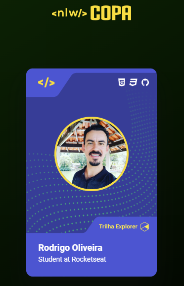
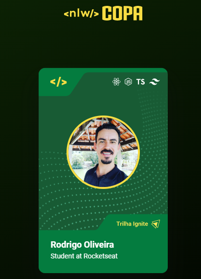

# Projeto criado no esquenta para a NLW-COPA da Rocketseat 🚀😁

## Card Explorer/Ignite

  

  

### Meus contatos
 

 
  
  
  
  
  

 

   <a href="https://github.com/RodrigoApOliveira">
   
   

### Atualmente estudando

 
 
 

 
  

